# crm-logistic-2.0

CRM система для SKYLAKE
На главной странице расположена кнопка для перехода на регистрацию нового пользователя либо для входа в систему для уже зарегистрированного пользователя.

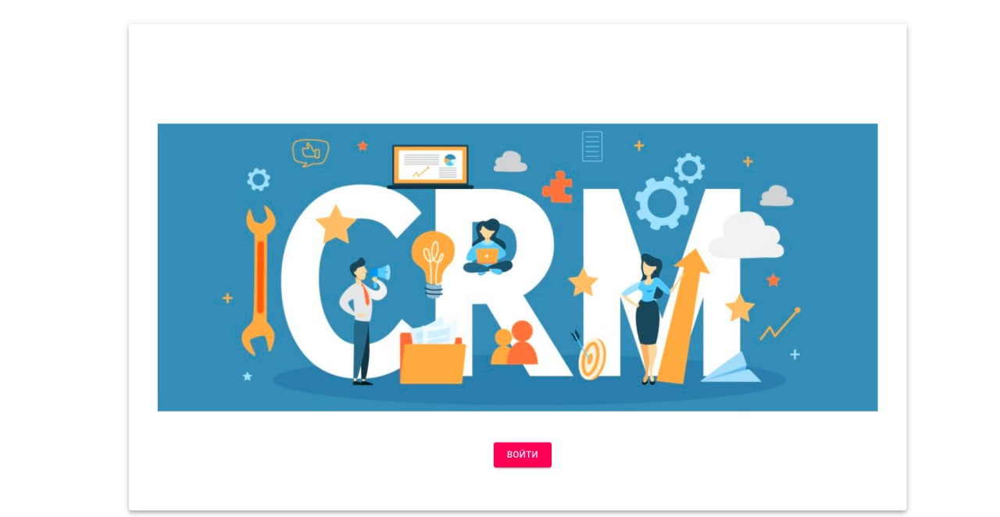, 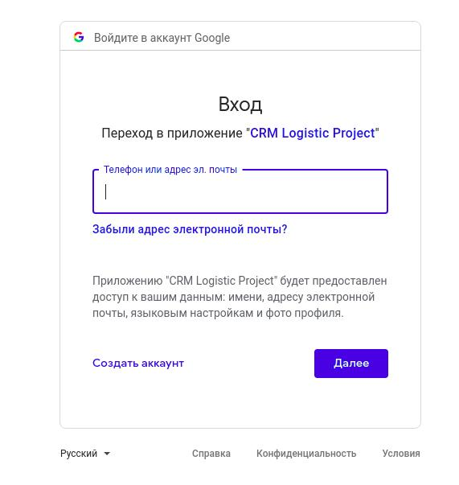

1. После входа в систему вы попадаете на главную страницу, где в верхнем меню есть четыре раздела. По умолчанию представлен раздел Календарь. Календарь может быть отображен по дням, по неделям и по месяцам. С помощью drag-and-drop можно передвигать встречи на другой день или время.
 

Для создания нового события кликните дважды на любое свободное поле.

Для изменения события кликните на иконку редактирования. 

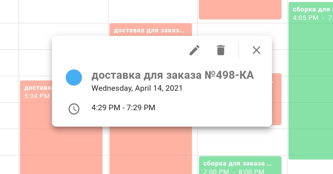

2. Второй раздел - панель администратора. Этот функционал доступен только администратору, он позволяет разграничить права доступа пользователей к системе. Здесь администратор может добавить  новых пользователей.

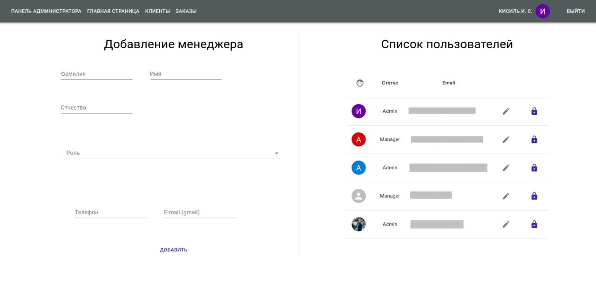

При нажатии на иконку редактирования переходим на страничку где можно редактировать данные текущих пользователей.

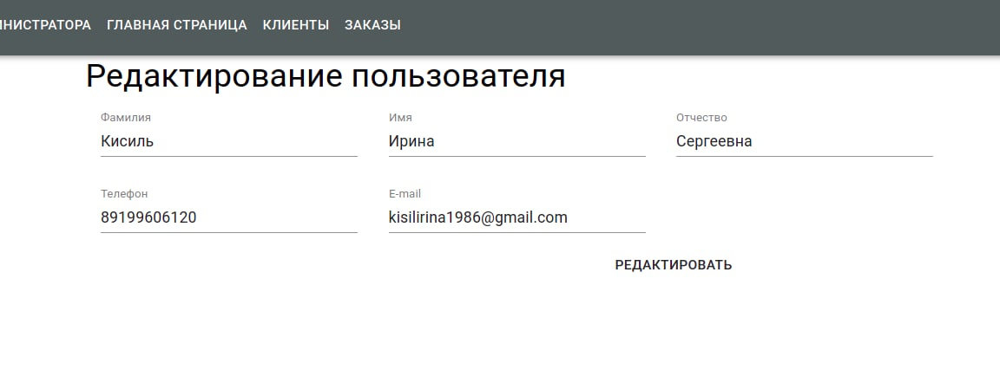

Также администратор может заблокировать пользователя, нажав на иконку блокировки.

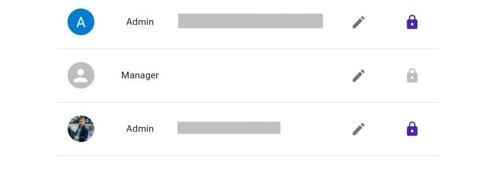

3. Третий раздел - клиенты. При вводе слова в поиск отфильтруются только нужные строки. Кнопка «Добавить клиента» позволяет добавить нового клиента.

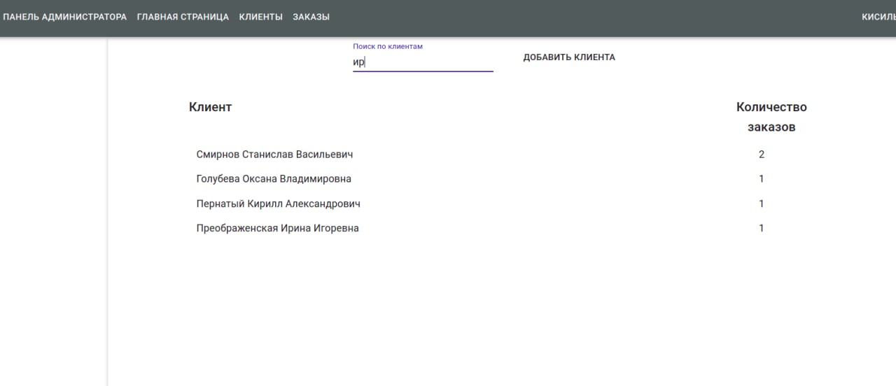

На странице добавления клиента необходимо ввести все необходимые поля и нажать кнопку «Добавить».

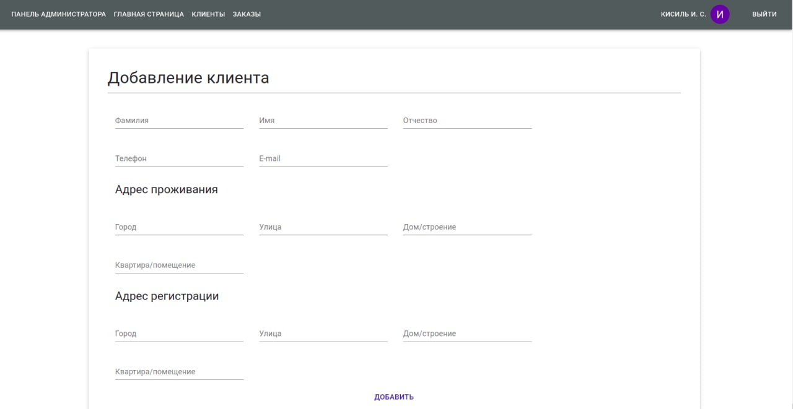

Можно редактировать или удалить клиента, нажав на иконки редактирования и удаления на странице с информацией о клиенте. Также можно добавлять заказ от данного клиента, нажав на кнопку «Добавить заказ».

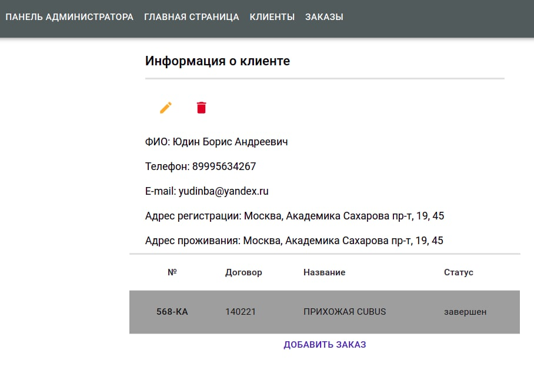, 
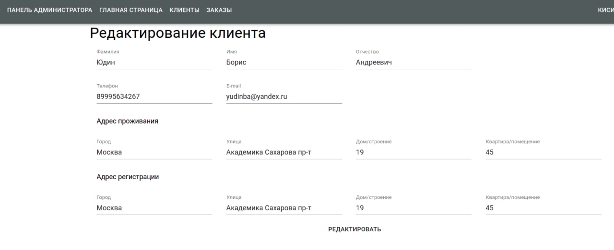

В поле «Комментарии по клиенту» можно оставить комментарий. Комментарии отображаются в хронологическом порядке. В комментариях также отображаются все изменения, произведенные с данным клиентом (редактирование, добавление заказа). 

4. Четвертый раздел - заказы. При вводе слова в поиск отфильтруются только нужные строки. Кнопка «Добавить заказ» позволяет добавить новый заказ.

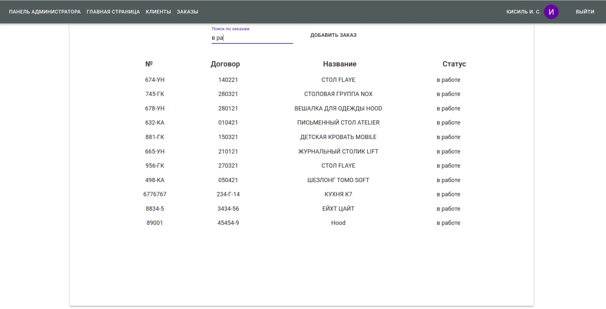

Для создания нового заказа необходимо заполнить все необходимые поля и выбрать клиента из базы данных.

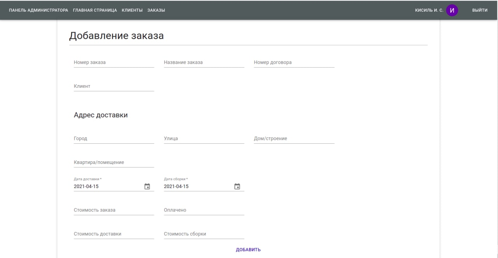

Можно редактировать или удалить заказ, нажав на иконки редактирования и удаления. Мы можем изменить статус заказа (заказ может быть «в работе», «завершен» или иметь «рекламацию»).

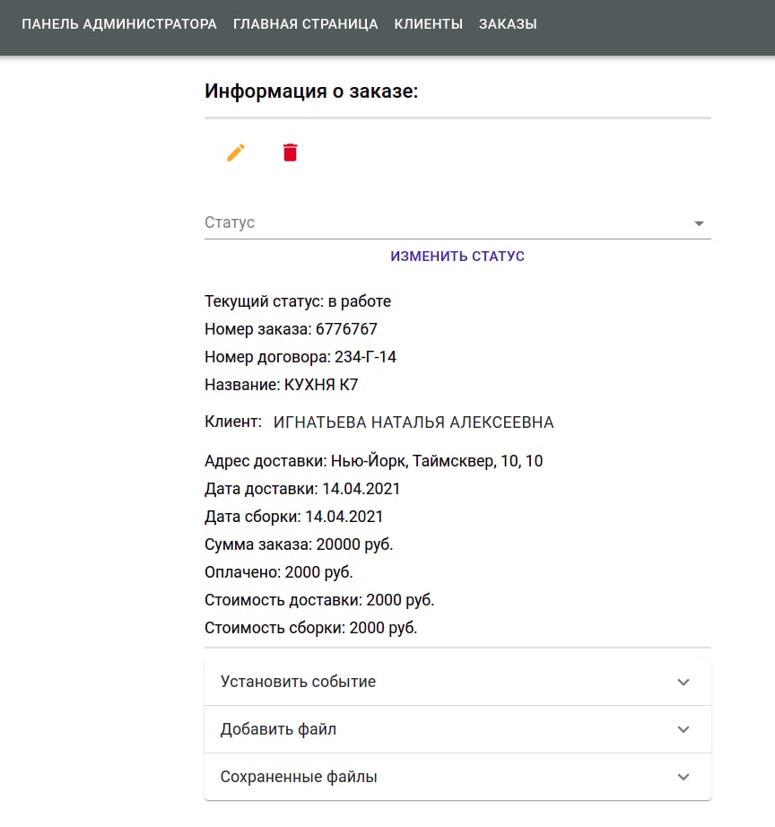

Развернув вкладку «Установить событие», можно добавить дату и время начала и окончания события (доставки или сборки) в календарь. 

Здесь же можно оставить дополнительные сведения к заказу.

Нажать кнопку «Установить событие».

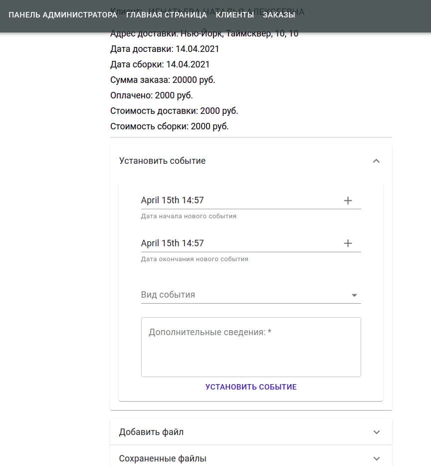

Открыв вкладку «Добавить файл», можно загрузить файлы, необходимые для работы с заказом. Загруженные файлы можно увидеть во вкладке «Сохраненные файлы».

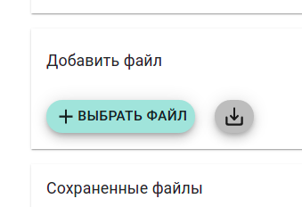

В поле «Комментарии к заказу» можно оставить комментарий. Комментарии отображаются в хронологическом порядке. В комментариях также отображаются все изменения, произведенные в заказе (смена статуса, установка нового события, редактирование). 

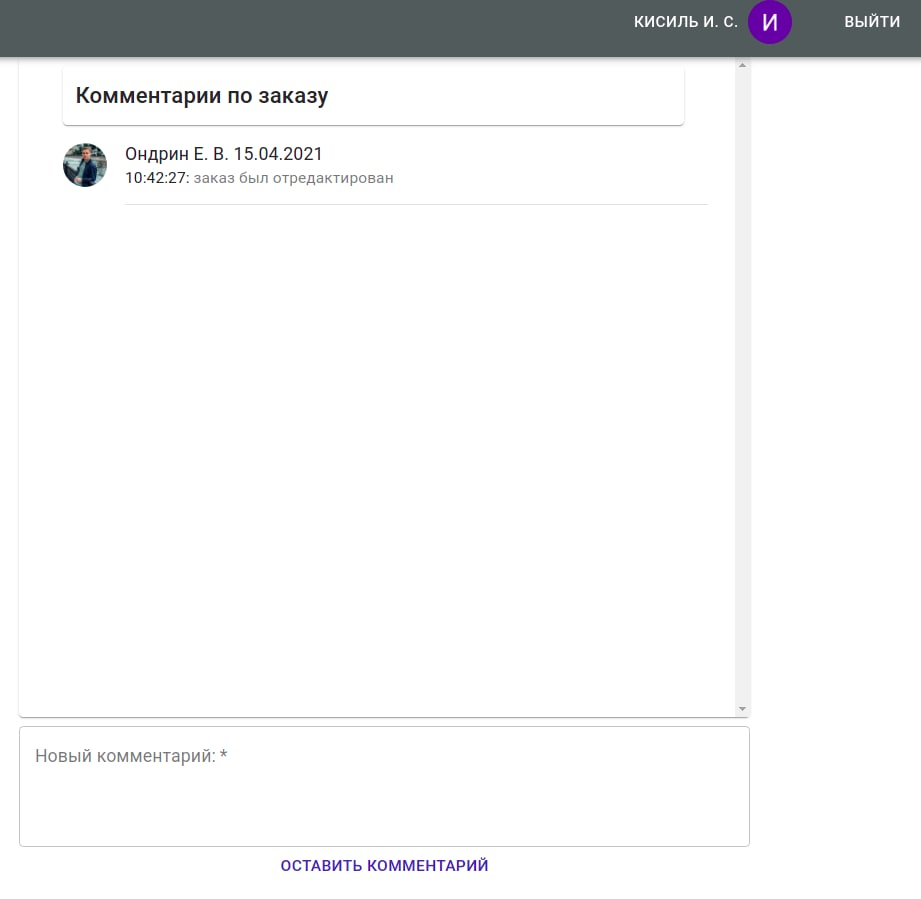
